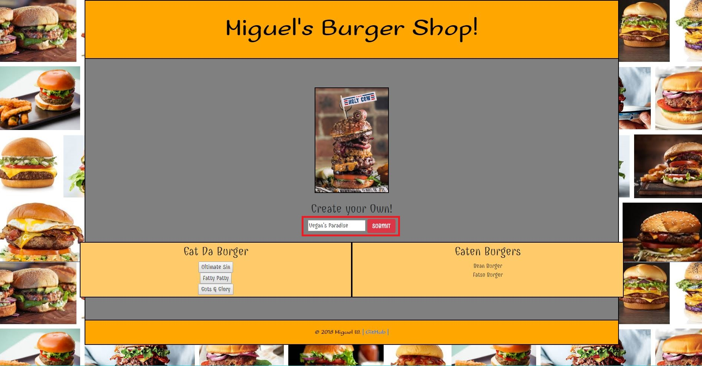
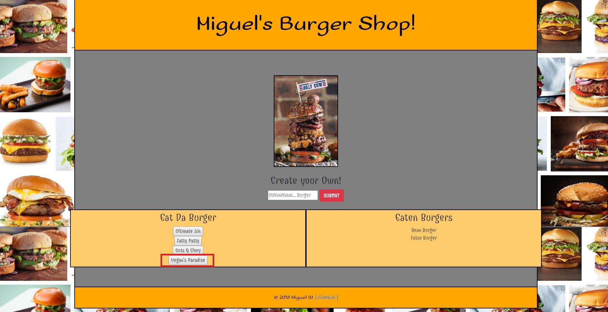

# Eat-Da-Burger
A Burger Eatin' Application that uses Node.js, Express, MySQL, Handlebars & Bootstrap.

## Description

This application demonstrates a simple full stack application with a front end implemented with HTML/CSS and elements from Bootstrap's framework and the backend implemented with Node.js and Express. HTML templating is done with the help of Handlebars.

The user enters the name of a burger to add it to the menu (this also adds the new burger entry into the MySQL database). 

The burger entry is added as *available* on the menu and placed on the left side of the screen. 

The user then eats any burger by clicking on it, which moves it into the adjacent column and updates its status to the database.

## Demo

The demo of the burger eating application can be found [here](https://eat-da-burger-mw.herokuapp.com/).

## Installation

To run the application locally, first clone this repository with the following command.

	git clone https://github.com/miguelaw/Eat-Da-Burger.git
	
Access to the project's folder

	cd Eat-Da-Burger

Next, install the application dependencies.

	npm install
	
Finally, run the node server locally.

	node server.js

	
Now, open the local application on port 3000 at the URL: `http://localhost:3000/`.

**Thank you for checking out my work!**
